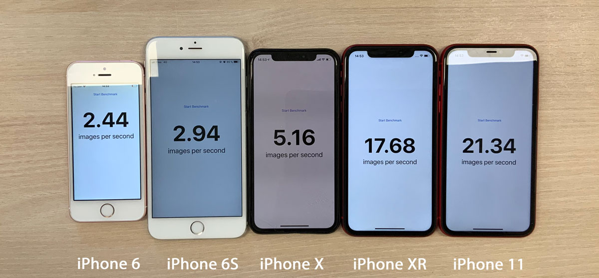

## Core ML Benchmark

Benchmarking Deeplab's performance using Core ML on the iPhone 11 and previous devices

## Running it

Most of the important code is in `benchmark/ViewController.swift`.

We simply load the model and the input data on initialization.
When the button is pressed, we run inference several time. When the process is done, we display the number of images per seconds.

